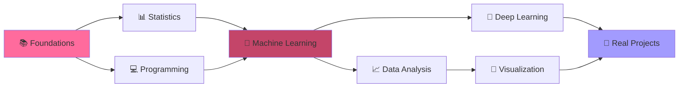

  

<!-- Animated Header -->
<h1 align="center">
  
</h1>

---

## 👩‍💻 About Me

🎓 **Data Science Student** passionate about uncovering insights from data and building intelligent systems

📊 **Currently Learning**: Advanced Machine Learning, Deep Learning Architectures, and Real-world Data Analytics

🌱 **Growing Skills**: Building end-to-end ML pipelines, Statistical Modeling, and Data Visualization

💡 **Interests**: Predictive Analytics, Natural Language Processing, Computer Vision

🎯 **Goal**: To become a proficient Data Scientist who can solve real-world problems through data-driven solutions

📧 **Reach me**: navodyasathsarani2003@gmail.com

 

---

## 🛠️👨‍💻 Programming Languages

### 💻 Core Technologies

<table>
<tr>
<td align="center" width="25%">

 <strong>Python</strong>
 Primary Language
 ⭐⭐⭐⭐
</td>
<td align="center" width="25%">

 <strong>R</strong>
 Statistical Computing
 ⭐⭐⭐
</td>
<td align="center" width="25%">

 <strong>MySQL</strong>
 Database Management
 ⭐⭐⭐⭐
</td>
<td align="center" width="25%">

 <strong>MS SQL</strong>
 Enterprise Database
 ⭐⭐⭐
</td>
</tr>
</table>

---

## 💻 Tech Stack & Tools

### 📚 Data Science & ML Libraries

  
  
  
  
  
  

### 📊 Data Visualization

  
  
  

### 🗄️ Databases

  
  

### 🛠️ Tools & Platforms

  
  
  
  
  

---

## 🎓 My Data Science Curriculum

---

### ✨ *"Data science is not just about algorithms, it's about asking the right questions"* ✨

### 💭 *"In data we trust, in insights we grow"* 💭

---

---

## 🤝 Let's Connect & Collaborate!

  
### 💬 Open to:
**🤝 Collaborations** • **📊 Data Projects** • **💡 Learning Together** • **🎓 Study Groups** • **💼 Internship Opportunities**

---

## 📊 Quick Stats

